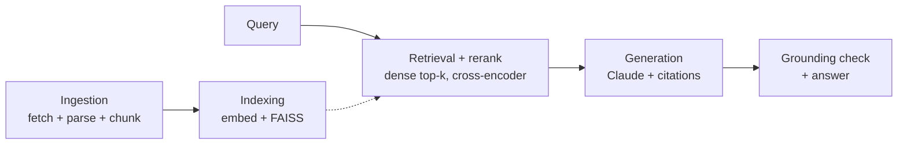

# RAG With Receipts

A retrieval-augmented generation pipeline over a scoped slice of the [Old School RuneScape
Wiki](https://oldschool.runescape.wiki/), built to demonstrate retrieval accuracy, grounded
and cited answers, and latency-optimized inference — not just chat-with-a-doc.

**Status:** complete and live on Cloud Run — see [Benchmarks](#benchmarks) for
measured numbers and [Deployment](#deployment) for the live URL.

## Why the OSRS Wiki

Chosen for a corpus that's deeply cross-referenced and numerically dense (exact XP values,
requirements, drop mechanics), which makes for a stronger eval set — both for multi-hop
retrieval questions and for the hallucination/grounding check. Content is CC BY-NC-SA 3.0;
used here for non-commercial, personal portfolio purposes.

## License

This project's code is MIT-licensed (see [LICENSE](LICENSE)). That covers the
pipeline, scripts, and config only — it does not relicense the OSRS Wiki
content itself, which remains CC BY-NC-SA 3.0, non-commercial, and attributed,
as described above.

## Architecture

Two offline stages build the index once; four online stages run per query;
`eval`/`telemetry` measure the pipeline and `api` serves it.



| Stage | Key design choice | Package |
|---|---|---|
| Ingestion | MediaWiki API fetch over a scoped corpus (combat category + 2 skill-training guides + 1 questline + its one-hop-linked item/monster pages); header-aware chunking, ~380 target tokens | [`src/rag_receipts/ingestion/`](src/rag_receipts/ingestion/) |
| Indexing | Local `BAAI/bge-large-en-v1.5` embeddings; FAISS flat index, in-process, zero recurring cost | [`src/rag_receipts/indexing/`](src/rag_receipts/indexing/) |
| Retrieval | Dense top-30 → cross-encoder rerank to top-5; reranker is `ms-marco-MiniLM-L-6-v2`, adopted after a measured sweep (Pareto-dominates the original default) | [`src/rag_receipts/retrieval/`](src/rag_receipts/retrieval/) |
| Generation | Claude Sonnet 5, forced tool-use for structured per-claim citations, hallucinated-citation validation against the retrieved set | [`src/rag_receipts/generation/`](src/rag_receipts/generation/) |
| Grounding check | NLI cross-encoder entailment/contradiction + lexical overlap per citation, combined into a grounded/contradicted/ungrounded verdict | [`src/rag_receipts/grounding/`](src/rag_receipts/grounding/) |
| Eval harness *(offline)* | LLM-as-judge correctness + retrieval metrics + grounding, run over a 55-question hand-authored gold set | [`src/rag_receipts/eval/`](src/rag_receipts/eval/) |
| Telemetry *(offline)* | Per-stage p50/p95/mean latency instrumentation on the real hot path | [`src/rag_receipts/telemetry/`](src/rag_receipts/telemetry/) |
| API *(serving)* | FastAPI wrapper (`/query`, `/livez`, `/readyz`) deployed on Cloud Run — see [Deployment](#deployment) | [`src/rag_receipts/api/`](src/rag_receipts/api/) |

## Benchmarks

All numbers below are from one clean run of the full 55-question hand-authored
gold set (`data/eval/qa_pairs.json`), under the pipeline's current default
config (`ms-marco-MiniLM-L-6-v2` reranker). Reproduce with
`python scripts/run_eval.py` / `python scripts/measure_latency.py`.

### Retrieval

| | Overall | Single-hop (n=35) | Multi-hop (n=15) |
|---|---|---|---|
| Hit rate | 0.96 | 0.97 | 0.93 |
| Recall | 0.88 | 0.97 | 0.67 |
| MRR | 0.75 | 0.81 | 0.61 |

Precision (not shown) is deliberately low by construction — the denominator
is `top_k_final=5` against a 1-2-chunk gold set, so even perfect retrieval
can't clear ~0.2-0.4.

### Correctness (LLM-as-judge)

| | Overall | Single-hop | Multi-hop |
|---|---|---|---|
| Accuracy | 0.84 | 1.00 | 0.47 |

Two caveats worth reading before trusting the multi-hop number: it's n=15,
small enough that a couple of borderline verdicts move it several points —
treat it as "meaningfully worse than single-hop," not a precise figure.
And the gap is dominantly a **retrieval** story, not a reasoning failure:
most non-fully-correct multi-hop cases trace back to the retrieved top-k
missing one of two gold chunks, with generation correctly declining rather
than fabricating the missing fact.

### Grounding (citation-level entailment + overlap check)

| Grounded | Contradicted | Ungrounded | Fully-grounded answers |
|---|---|---|---|
| 0.95 | 0.05 | 0.00 | 0.91 |

(77 citations checked across 44 answers.) Read `contradicted` as "flagged
for human review," not "confirmed error" — manual inspection found the
flagged cases were false positives from the general-domain NLI model
misreading this corpus's flattened-table/telegraphic chunk style, not real
contradictions.

### Reranker sweep (what justified the current default)

| Model | Recall | Hit rate | MRR | Rerank p50 | Rerank p95 |
|---|---|---|---|---|---|
| `bge-reranker-base` (original default) | 0.83 | 0.90 | 0.70 | 552ms | 567ms |
| `bge-reranker-v2-m3` (stronger) | 0.90 | 0.98 | 0.84 | 2775ms | 3331ms |
| **`ms-marco-MiniLM-L-6-v2` (adopted)** | **0.88** | **0.96** | **0.75** | **111ms** | **128ms** |

The adopted model Pareto-dominates the original default: higher recall,
hit-rate, and MRR, *and* ~5x lower rerank latency (552ms→111ms p50) — not a
tradeoff call.
`bge-reranker-v2-m3` is more accurate still, but at a ~26x latency cost over
the adopted default that isn't justified once end-to-end latency is already
dominated by generation (see below).

### Latency (per-stage, local GPU)

| Stage | p50 | p95 |
|---|---|---|
| embed_query | 80ms | 154ms |
| dense_search | 0.3ms | 0.7ms |
| rerank | 276ms | 340ms |
| retrieval_total | 349ms | 425ms |
| generate | 2918ms | 7224ms |
| end_to_end | 3256ms | 7577ms |

Generation (the Claude API round-trip) dominates end-to-end latency, not
retrieval. Treat p95 as directional, not precise — it's the ~52nd-highest
value out of 55 samples, and `generate_s` in particular varies run to run
since generation isn't temperature-pinned (adaptive thinking doesn't accept
sampling params on this model).

### Vertex AI Search comparison (stretch goal)

This project uses Cloud Run/GCS/Artifact Registry as deployment substrate but
hand-builds the retrieval/generation pipeline itself rather than using a
fully-managed RAG product, on the argument that chunking, embedding choice, a
local vector store, reranking, per-stage latency, and a grounding check are
exactly the internals a managed service hides (see `CLAUDE.md`'s "Why not a
fully-managed RAG service?" section for the full argument). This section
backs that argument with real numbers: Vertex AI Search (Discovery Engine)
was provisioned over the same 955-chunk corpus and measured against the
hand-built pipeline on the same 55-question gold set, two ways:

- **Config A (retrieval-only):** Vertex's Search API → our own
  Generator/Judge/GroundingChecker. Isolates retrieval quality on equal
  footing against the hand-built `Retriever`.
- **Config B (fully managed):** Vertex's own Answer API end-to-end
  (retrieval + generation + its own citations), run through our
  `GroundingChecker` too for a same-method comparison, alongside Vertex's
  self-reported `grounding_score`.

| Metric | Baseline (ours) | Config A (Vertex Search) | Config B (Vertex Answer) |
|---|---|---|---|
| Retrieval hit rate | 0.96 | **0.98** | 0.96 |
| Retrieval recall | 0.88 | **0.96** | 0.94 |
| Retrieval MRR | 0.752 | 0.823 | **0.858** |
| Correctness accuracy | 0.836 | **0.927** | 0.855 |
| Grounded rate (our checker) | 0.948 | **0.968** | 0.838 |
| Vertex's own grounding_score | — | — | 0.688 |
| End-to-end latency (p50 / p95) | 3.26s / 7.58s | 5.02s / 9.31s | **6.39s / 8.88s** |

Vertex's managed retrieval (config A) scored *better* than the hand-built
pipeline on every retrieval and correctness metric measured here — a genuine,
not-cherry-picked result. It's also slower end-to-end and, as the asymmetries
below make clear, wasn't exercising the part of the job (chunking) this
project argues is worth doing by hand.

**Four structural asymmetries, carried verbatim into
`results/vertex_comparison.json`'s `methodology_notes` field, limit how far
this comparison generalizes:**

1. **Chunking wasn't compared.** Vertex ingested this project's *already-chunked*
   955 objects (one GCS object per existing `chunk_id`), not raw pages — so
   config A/B measure Vertex's retrieval/ranking quality only, not its own
   chunking. This was necessary to score exact `chunk_id` matches against the
   existing gold set, but it means "point Vertex at raw documents and let it
   chunk" — the normal way to use the product — isn't what's measured here.
2. **Latency isn't apples-to-apples.** The baseline exposes staged latency
   (embed/dense/rerank/generate). Vertex's Search and Answer APIs each expose
   only one end-to-end number per call, with no internal stage split visible
   from outside. Don't compare Vertex's end-to-end number against a single
   baseline stage.
3. **Config B's retrieval numbers mean something narrower.** They're scored
   against the chunk_ids Vertex's Answer API actually *cited* (deduplicated —
   a cited chunk legitimately repeats once per claim it supports, which
   inflated recall above 1.0 before that was caught and fixed), not a
   separately exposed ranked search-results list. Treat it as "what Vertex
   chose to cite," not "everything it retrieved."
4. **Config B has no clean abstention signal, and this measurably distorts
   its correctness number.** Vertex's Answer API doesn't refuse or flag
   unanswerable queries the way this project's own forced-tool-schema
   `Generator` does — confirmed against a real out-of-corpus question, it
   writes a prose "no information found" answer as normal non-empty text,
   and `answer_skipped_reasons` stays empty. Concretely: all 5 of the gold
   set's deliberately-unanswerable questions scored `incorrectly_answered`
   for config B (vs. the baseline's 5/5 `correct_abstention` on the same
   questions). Had config B abstained correctly, its accuracy would be
   0.945 — above both the baseline and config A — so the correctness gap
   reported above is currently an artifact of this missing signal, not a
   measured generation-quality difference.

Two more real findings from provisioning, not polished away: Discovery
Engine's Answer API enforces an undocumented-ahead-of-time 10 LLM-requests/
minute project quota (hit mid-run; `VertexAnswerer` now paces and retries
around it), and `document.struct_data` on a live response is a proto-plus
`MapComposite`, not the protobuf `Struct` the public docs implied — both
required fixing against the live API, not just its documentation. Direct
query cost for this comparison (55 search + ~67 answer calls, the extra from
one quota-triggered retry) was $0 — comfortably inside Vertex AI Search's
10,000-free-queries/month tier. The data store, engine, and GCS bucket were
torn down immediately after these numbers were captured.

## Deployment

A live version runs on GCP Cloud Run:
**https://rag-receipts-api-374659103328.northamerica-northeast1.run.app**

The service is public but gated by a shared demo key (`/query` requires an
`X-Demo-Key` header) — paste it into the "Demo key" field on the page. Don't
have one? Email [daniel.lofeodo@gmail.com](mailto:daniel.lofeodo@gmail.com)
to request it.

### GCP resources used

| Resource | Role |
|---|---|
| Cloud Run | Serves the FastAPI app (`src/rag_receipts/api/`); scales to zero when idle, `max-instances=2` |
| Artifact Registry | Hosts the built container image |
| Cloud Build | Builds the image (embedding + reranker models baked in at build time) and pushes it |
| GCS | Holds `faiss.index` / `index_metadata.parquet`, pulled on cold start |
| Secret Manager | `anthropic-api-key`, `demo-api-key` |
| Cloud Logging | Captures stdout, including one structured JSON line per `/query` request with the full per-stage timing breakdown |

### Running locally

```
docker build -t rag-receipts-api .
docker run -p 8080:8080 \
  -e ANTHROPIC_API_KEY=sk-ant-... \
  -v "$(pwd)/data/index:/app/data/index:ro" \
  rag-receipts-api
```

Then open `http://localhost:8080/` (no `DEMO_API_KEY` set locally, so `/query`
is open) or hit `/livez`, `/readyz`, `/query` directly.

### Redeploying

```
gcloud builds submit --tag northamerica-northeast1-docker.pkg.dev/rag-with-receipts/rag-receipts/api:latest \
  --project rag-with-receipts

gcloud run deploy rag-receipts-api \
  --image=northamerica-northeast1-docker.pkg.dev/rag-with-receipts/rag-receipts/api:latest \
  --region=northamerica-northeast1 --project=rag-with-receipts \
  --allow-unauthenticated \
  --set-secrets=ANTHROPIC_API_KEY=anthropic-api-key:latest,DEMO_API_KEY=demo-api-key:latest \
  --set-env-vars=INDEX_GCS_BUCKET=rag-with-receipts-index \
  --max-instances=2 --memory=4Gi --cpu=2 --timeout=60 --cpu-boost
```

### A note on latency: Cloud Run vs. local hardware

The latency table above was measured on local hardware with a GPU (RTX
3060). Cloud Run has no GPU, so all inference runs on its allocated 2 vCPUs
— and the gap is larger than "CPU vs GPU" alone would suggest. A few real
timed `/query` calls against the live deployment (steady-state, after the
first cold-start call):

| Stage | Local GPU (`measure_latency.py`) | Local Docker, CPU | Cloud Run, 2 vCPU |
|---|---|---|---|
| embed_query | 80ms p50 | ~100ms | ~500ms |
| rerank | 276ms p50 (MiniLM) | ~700ms | ~5000ms |
| generate | 2918ms p50 | ~3400ms | ~3400ms |
| total | 3256ms p50 | ~4200ms | ~9000ms |

Rerank is the stage that degrades the most on Cloud Run — about 7x slower
than the same model on the same machine's CPU outside a container, and ~18x
slower than the local-GPU number measured here. Not chased further here;
candidates for a future pass: tuning `OMP_NUM_THREADS`/torch thread count
for the 2-vCPU environment, or bumping Cloud Run's CPU allocation.
