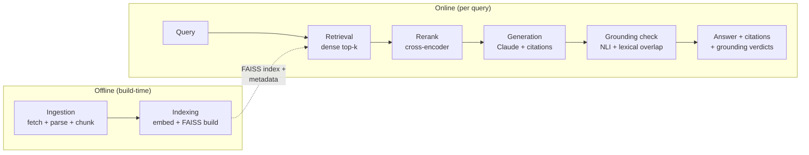

# RAG With Receipts

A retrieval-augmented generation pipeline over a scoped slice of the [Old School RuneScape
Wiki](https://oldschool.runescape.wiki/), built to demonstrate retrieval accuracy, grounded
and cited answers, and latency-optimized inference — not just chat-with-a-doc.

**Status:** early scaffold. Architecture notes, setup instructions, and benchmark numbers
will land here as each pipeline stage is built — see [CLAUDE.md](CLAUDE.md) for the current
step and full plan.

## Why the OSRS Wiki

Chosen for a corpus that's deeply cross-referenced and numerically dense (exact XP values,
requirements, drop mechanics), which makes for a stronger eval set — both for multi-hop
retrieval questions and for the hallucination/grounding check. Content is CC BY-NC-SA 3.0;
used here for non-commercial, personal portfolio purposes.

## License

This project's code is MIT-licensed (see [LICENSE](LICENSE)). That covers the
pipeline, scripts, and config only — it does not relicense the OSRS Wiki
content itself, which remains CC BY-NC-SA 3.0, non-commercial, and attributed,
as described above.

## Architecture

Two offline stages build the index once; four online stages run per query;
`eval`/`telemetry` measure the pipeline and `api` serves it.



| Stage | Key design choice | Package |
|---|---|---|
| Ingestion | MediaWiki API fetch over a scoped corpus (combat category + 2 skill-training guides + 1 questline + its one-hop-linked item/monster pages); header-aware chunking, ~380 target tokens | [`src/rag_receipts/ingestion/`](src/rag_receipts/ingestion/) |
| Indexing | Local `BAAI/bge-large-en-v1.5` embeddings; FAISS flat index, in-process, zero recurring cost | [`src/rag_receipts/indexing/`](src/rag_receipts/indexing/) |
| Retrieval | Dense top-30 → cross-encoder rerank to top-5; reranker is `ms-marco-MiniLM-L-6-v2`, adopted after a measured sweep (Pareto-dominates the original default) | [`src/rag_receipts/retrieval/`](src/rag_receipts/retrieval/) |
| Generation | Claude Sonnet 5, forced tool-use for structured per-claim citations, hallucinated-citation validation against the retrieved set | [`src/rag_receipts/generation/`](src/rag_receipts/generation/) |
| Grounding check | NLI cross-encoder entailment/contradiction + lexical overlap per citation, combined into a grounded/contradicted/ungrounded verdict | [`src/rag_receipts/grounding/`](src/rag_receipts/grounding/) |
| Eval harness *(offline)* | LLM-as-judge correctness + retrieval metrics + grounding, run over a 55-question hand-authored gold set | [`src/rag_receipts/eval/`](src/rag_receipts/eval/) |
| Telemetry *(offline)* | Per-stage p50/p95/mean latency instrumentation on the real hot path | [`src/rag_receipts/telemetry/`](src/rag_receipts/telemetry/) |
| API *(serving)* | FastAPI wrapper (`/query`, `/livez`, `/readyz`) deployed on Cloud Run — see [Deployment](#deployment) | [`src/rag_receipts/api/`](src/rag_receipts/api/) |

## Benchmarks

All numbers below are from one clean run of the full 55-question hand-authored
gold set (`data/eval/qa_pairs.json`), under the pipeline's current default
config (`ms-marco-MiniLM-L-6-v2` reranker). Reproduce with
`python scripts/run_eval.py` / `python scripts/measure_latency.py`.

### Retrieval

| | Overall | Single-hop (n=35) | Multi-hop (n=15) |
|---|---|---|---|
| Hit rate | 0.96 | 0.97 | 0.93 |
| Recall | 0.88 | 0.97 | 0.67 |
| MRR | 0.75 | 0.81 | 0.61 |

Precision (not shown) is deliberately low by construction — the denominator
is `top_k_final=5` against a 1-2-chunk gold set, so even perfect retrieval
can't clear ~0.2-0.4.

### Correctness (LLM-as-judge)

| | Overall | Single-hop | Multi-hop |
|---|---|---|---|
| Accuracy | 0.84 | 1.00 | 0.47 |

Two caveats worth reading before trusting the multi-hop number: it's n=15,
small enough that a couple of borderline verdicts move it several points —
treat it as "meaningfully worse than single-hop," not a precise figure.
And the gap is dominantly a **retrieval** story, not a reasoning failure:
most non-fully-correct multi-hop cases trace back to the retrieved top-k
missing one of two gold chunks, with generation correctly declining rather
than fabricating the missing fact (full trace in CLAUDE.md's Step 5 notes).

### Grounding (citation-level entailment + overlap check)

| Grounded | Contradicted | Ungrounded | Fully-grounded answers |
|---|---|---|---|
| 0.95 | 0.05 | 0.00 | 0.91 |

(77 citations checked across 44 answers.) Read `contradicted` as "flagged
for human review," not "confirmed error" — in the original run, all 3
flagged citations were manually confirmed to be false positives from the
general-domain NLI model misreading this corpus's flattened-table/telegraphic
chunk style, not real contradictions (full writeup in CLAUDE.md's Step 6
notes).

### Reranker sweep (what justified the current default)

| Model | Recall | Hit rate | MRR | Rerank p50 | Rerank p95 |
|---|---|---|---|---|---|
| `bge-reranker-base` (original default) | 0.83 | 0.90 | 0.70 | 552ms | 567ms |
| `bge-reranker-v2-m3` (stronger) | 0.90 | 0.98 | 0.84 | 2775ms | 3331ms |
| **`ms-marco-MiniLM-L-6-v2` (adopted)** | **0.88** | **0.96** | **0.75** | **111ms** | **128ms** |

The adopted model Pareto-dominates the original default: higher recall,
hit-rate, and MRR, *and* ~5x lower rerank latency (552ms→111ms p50) — not a
tradeoff call.
`bge-reranker-v2-m3` is more accurate still, but at a ~26x latency cost over
the adopted default that isn't justified once end-to-end latency is already
dominated by generation (see below).

### Latency (per-stage, local GPU)

| Stage | p50 | p95 |
|---|---|---|
| embed_query | 80ms | 154ms |
| dense_search | 0.3ms | 0.7ms |
| rerank | 276ms | 340ms |
| retrieval_total | 349ms | 425ms |
| generate | 2918ms | 7224ms |
| end_to_end | 3256ms | 7577ms |

Generation (the Claude API round-trip) dominates end-to-end latency, not
retrieval. Treat p95 as directional, not precise — it's the ~52nd-highest
value out of 55 samples, and `generate_s` in particular varies run to run
since generation isn't temperature-pinned (adaptive thinking doesn't accept
sampling params on this model).

## Deployment

A live version runs on GCP Cloud Run:
**https://rag-receipts-api-374659103328.northamerica-northeast1.run.app**

The service is public but gated by a shared demo key (`/query` requires an
`X-Demo-Key` header matching a value kept in Secret Manager) — paste it into
the "Demo key" field on the page. Don't have one? Email
[daniel.lofeodo@gmail.com](mailto:daniel.lofeodo@gmail.com) to request it.
This was a
fallback from the original plan (Cloud Run's native IAP, gating access behind
Google sign-in): IAP's OAuth consent setup turns out to require the GCP
project to belong to an Organization, which a personal-account project isn't
part of, and even where that requirement is met the resulting brand only
admits users from the same Workspace domain — not the "any recruiter, any
Google account" goal — so a shared key is what's actually deployed.

### GCP resources used

| Resource | Role |
|---|---|
| Cloud Run | Serves the FastAPI app (`src/rag_receipts/api/`); scales to zero when idle, `max-instances=2` |
| Artifact Registry | Hosts the built container image |
| Cloud Build | Builds the image (embedding + reranker models baked in at build time) and pushes it |
| GCS | Holds `faiss.index` / `index_metadata.parquet`, pulled on cold start |
| Secret Manager | `anthropic-api-key`, `demo-api-key` |
| Cloud Logging | Captures stdout, including one structured JSON line per `/query` request with the full per-stage timing breakdown |

### Running locally

```
docker build -t rag-receipts-api .
docker run -p 8080:8080 \
  -e ANTHROPIC_API_KEY=sk-ant-... \
  -v "$(pwd)/data/index:/app/data/index:ro" \
  rag-receipts-api
```

Then open `http://localhost:8080/` (no `DEMO_API_KEY` set locally, so `/query`
is open) or hit `/livez`, `/readyz`, `/query` directly.

### Redeploying

```
gcloud builds submit --tag northamerica-northeast1-docker.pkg.dev/rag-with-receipts/rag-receipts/api:latest \
  --project rag-with-receipts

gcloud run deploy rag-receipts-api \
  --image=northamerica-northeast1-docker.pkg.dev/rag-with-receipts/rag-receipts/api:latest \
  --region=northamerica-northeast1 --project=rag-with-receipts \
  --allow-unauthenticated \
  --set-secrets=ANTHROPIC_API_KEY=anthropic-api-key:latest,DEMO_API_KEY=demo-api-key:latest \
  --set-env-vars=INDEX_GCS_BUCKET=rag-with-receipts-index \
  --max-instances=2 --memory=4Gi --cpu=2 --timeout=60 --cpu-boost
```

### A note on latency: Cloud Run numbers are not the Step 7 numbers

Step 7's measured p50/p95 latency table was taken on local hardware with a
GPU (RTX 3060). Cloud Run has no GPU, so all inference runs on its allocated
2 vCPUs — and the gap is larger than "CPU vs GPU" alone would suggest. A few
real timed `/query` calls against the live deployment (steady-state, after
the first cold-start call):

| Stage | Local GPU (`measure_latency.py`) | Local Docker, CPU | Cloud Run, 2 vCPU |
|---|---|---|---|
| embed_query | 80ms p50 | ~100ms | ~500ms |
| rerank | 276ms p50 (MiniLM) | ~700ms | ~5000ms |
| generate | 2918ms p50 | ~3400ms | ~3400ms |
| total | 3256ms p50 | ~4200ms | ~9000ms |

Rerank is the stage that degrades the most on Cloud Run — about 7x slower
than the same model on the same machine's CPU outside a container, and ~18x
slower than the local-GPU number measured here. This wasn't chased further in
Step 8 (which is a deployment step, not a second latency-optimization pass) -
documented here as a known, measured gap rather than papered over. Candidates
for a future pass, not done here: tuning `OMP_NUM_THREADS`/torch thread
count for the 2-vCPU environment, or bumping Cloud Run's CPU allocation.
