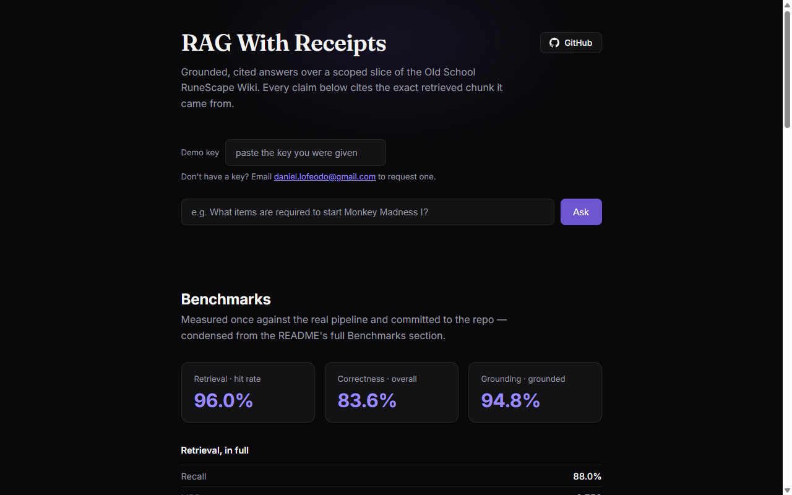
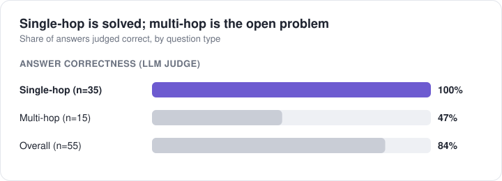
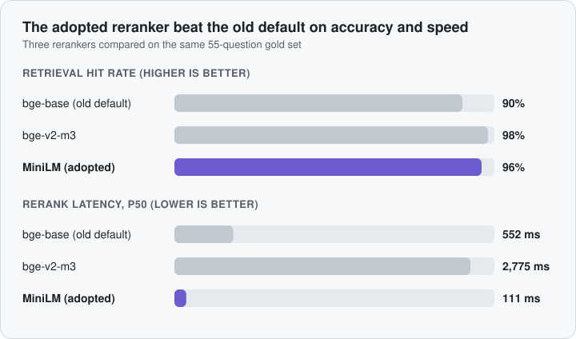
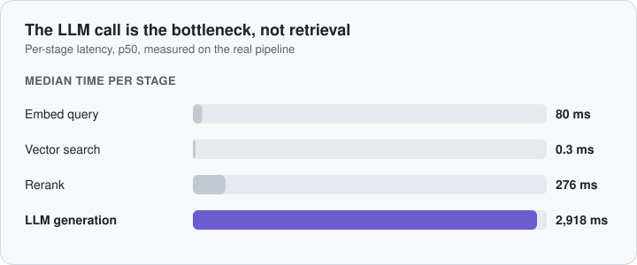
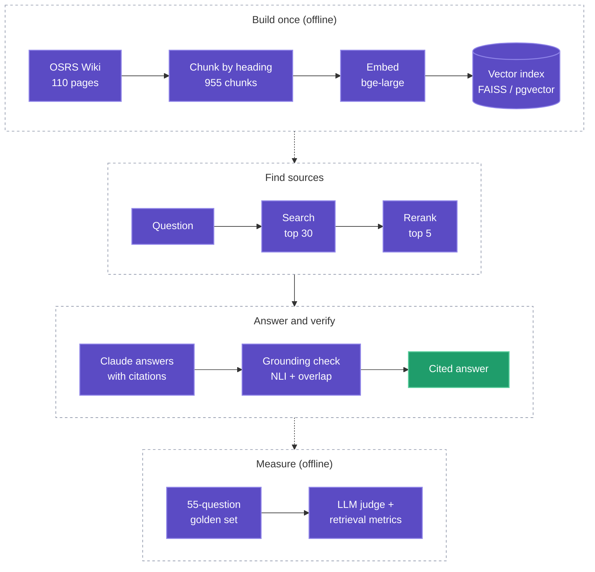

# RAG With Receipts

**Ask a question, get an answer where every claim links to the exact source passage, and an automatic check that the source really says it.**

A production-style retrieval-augmented generation (RAG) system over the [Old School RuneScape Wiki](https://oldschool.runescape.wiki/). It's built to show the parts of RAG that usually get skipped: a hand-labelled golden dataset, a full evaluation harness, measured optimizations, and deployment on GCP.

**[Live demo](https://rag-receipts-api-374659103328.northamerica-northeast1.run.app)** · [Benchmarks](docs/benchmarks.md) · [Architecture](docs/architecture.md) · [Experiments](docs/experiments.md)

## What it does

> **Q:** What items are required to start Monkey Madness I?
> **A:** A gold bar, five empty inventory slots, a ball of wool, monkey bones or a Karamja corpse, and five bananas. *[cites `Monkey_Madness_I__003`, the exact chunk it came from]*
>
> **Q:** What are the steps to complete the Cook's Assistant quest? *(not in the corpus)*
> **A:** *"The retrieved chunks do not contain any information about the Cook's Assistant quest..."* It declines instead of guessing.

Every answer carries its citations, every citation is verified to be a real retrieved passage, and a second model checks that the passage supports the claim.

## Results at a glance

Measured on a **55-question hand-written golden dataset** (70% single-hop, 30% multi-hop, 5 deliberately unanswerable).

| Retrieval hit rate | Answer correctness | Claims grounded in sources | Unanswerable questions refused | p50 end-to-end latency |
|:---:|:---:|:---:|:---:|:---:|
| **96%** | **84%** | **95%** | **4 of 5** | **3.3 s** |

**Single-hop questions are solved; multi-hop is the open problem.** The multi-hop gap is mostly a retrieval-recall issue, not a reasoning one.

<picture>
  <source media="(prefers-color-scheme: dark)" srcset="docs/img/chart_correctness_dark.svg">
  
</picture>

**A measured optimization:** the smallest reranker beat the default on accuracy *and* ran 5x faster.

<picture>
  <source media="(prefers-color-scheme: dark)" srcset="docs/img/chart_reranker_dark.svg">
  
</picture>

**Where the time goes:** the LLM call dominates, so retrieval tuning has already hit diminishing returns.

<picture>
  <source media="(prefers-color-scheme: dark)" srcset="docs/img/chart_latency_dark.svg">
  
</picture>

Full tables, caveats and methodology: **[docs/benchmarks.md](docs/benchmarks.md)**.

## How it works

| Step | What happens | Why it matters |
|---|---|---|
| Chunk | Split by wiki heading, tables kept as rows | Keeps facts intact and citable |
| Embed + search | Local `bge-large` embeddings, vector search | No per-query embedding API cost |
| Rerank | Cross-encoder rescores the top 30 | Fixes the order the vector search gets wrong |
| Generate | Claude must answer through a citation schema | Citations are structured data, not free text |
| Verify | Cited IDs are checked against what was retrieved; an NLI model checks entailment | Catches fabricated and unsupported claims |
| Abstain | If the sources don't answer it, say so | Refusing beats hallucinating |

Design details: **[docs/architecture.md](docs/architecture.md)**.

## Skills demonstrated

| Skill | Evidence in this repo |
|---|---|
| **Golden datasets** | 55 hand-authored Q/A pairs with gold chunk IDs, single/multi-hop split and unanswerable cases, validated against the real corpus |
| **Evaluation frameworks** | LLM-as-judge correctness, retrieval hit rate / recall / MRR, citation-level grounding, all broken down by question type |
| **Embeddings and retrieval** | Header-aware chunking, local `bge-large` embeddings, dense retrieval, cross-encoder reranking |
| **Latency optimization** | Per-stage p50/p95 instrumentation; a reranker sweep that cut rerank time 5x with higher accuracy |
| **Hallucination control** | Forced tool-use citations, hallucinated-citation detection, NLI grounding check, abstention on unanswerable questions |
| **Vector databases** | FAISS and **pgvector on Cloud SQL** behind one swappable interface; verified to return identical results (55/55) |
| **MLOps / cloud** | Docker, GCP Cloud Run, Artifact Registry, GCS, Secret Manager, Cloud Logging, scale-to-zero |
| **Build vs buy** | Benchmarked against managed Vertex AI Search on the same data and questions |
| **LLM cost/quality tradeoffs** | Haiku vs Sonnet on accuracy, grounding, latency and cost |
| **Tool use / structured output** | Citations returned through a forced tool schema and validated |
| **Engineering rigor** | 246 tests, benchmarks checked against bugs (a GPU-contention latency artifact, recall above 1.0), caveats reported honestly |

## Side experiments

| Experiment | Finding |
|---|---|
| **Vertex AI Search vs this pipeline** | The managed retrieval scored higher on retrieval and correctness, but wasn't tested on chunking, and has no abstention signal. [Details](docs/experiments.md#vertex-ai-search-vs-hand-built) |
| **Haiku 4.5 vs Sonnet 5** | About the same accuracy; Haiku better grounded, faster at the tail, half the cost. [Details](docs/experiments.md#haiku-45-vs-sonnet-5) |
| **pgvector on Cloud SQL vs FAISS** | Identical retrieval; vector search about 75x slower over the network but only 4% slower end to end. [Details](docs/experiments.md#pgvector-on-cloud-sql-vs-faiss) |

## Docs

| | |
|---|---|
| [Architecture](docs/architecture.md) | Design choices per stage, corpus scope, why not a managed RAG service |
| [Benchmarks](docs/benchmarks.md) | Every metric table with methodology and caveats |
| [Experiments](docs/experiments.md) | Vertex AI Search, Haiku vs Sonnet, pgvector |
| [Deployment](docs/deployment.md) | GCP setup, redeploy commands, Cloud Run vs local latency |
| [Running locally](docs/running-locally.md) | Docker, scripts, install notes |

## Live demo access

The demo is public but gated by a shared key to bound API cost. Email [daniel.lofeodo@gmail.com](mailto:daniel.lofeodo@gmail.com) to request one. The benchmarks panel on the page is open without it.

## License and attribution

Code is MIT-licensed ([LICENSE](LICENSE)). The corpus is content from the [OSRS Wiki](https://oldschool.runescape.wiki/), licensed CC BY-NC-SA 3.0 and used here for non-commercial, portfolio purposes. The MIT license does not cover it.
