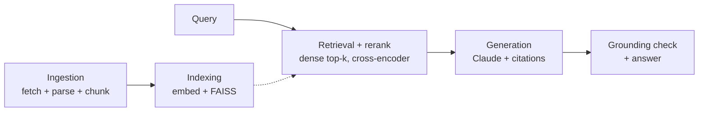

# Architecture

Two offline stages build the index once. Four online stages run per query. `eval` and `telemetry` measure the pipeline; `api` serves it.

## Design choices by stage

| Stage | Key design choice | Package |
|---|---|---|
| Ingestion | MediaWiki API fetch over a scoped corpus (combat category + 2 skill-training guides + 1 questline + its one-hop-linked item/monster pages); header-aware chunking, ~380 target tokens, breadcrumb prepended | [`ingestion/`](../src/rag_receipts/ingestion/) |
| Indexing | Local `BAAI/bge-large-en-v1.5` embeddings; FAISS flat inner-product index over normalized vectors, in-process | [`indexing/`](../src/rag_receipts/indexing/) |
| Vector store | `VectorStore` Protocol with FAISS (default) and pgvector on Cloud SQL, config-switched | [`vectorstore/`](../src/rag_receipts/vectorstore/) |
| Retrieval | Dense top-30, cross-encoder rerank to top-5; `ms-marco-MiniLM-L-6-v2` adopted after a measured sweep | [`retrieval/`](../src/rag_receipts/retrieval/) |
| Generation | Claude Sonnet 5, forced tool-use for structured per-claim citations, every cited `chunk_id` validated against the retrieved set | [`generation/`](../src/rag_receipts/generation/) |
| Grounding check | NLI cross-encoder entailment/contradiction + lexical overlap per citation | [`grounding/`](../src/rag_receipts/grounding/) |
| Eval harness | LLM-as-judge correctness + retrieval metrics + grounding over a 55-question gold set | [`eval/`](../src/rag_receipts/eval/) |
| Telemetry | Per-stage p50/p95/mean latency on the real hot path | [`telemetry/`](../src/rag_receipts/telemetry/) |
| API | FastAPI (`/query`, `/livez`, `/readyz`, `/benchmarks`) on Cloud Run, see [deployment.md](deployment.md) | [`api/`](../src/rag_receipts/api/) |

## Corpus

The OSRS Wiki is deeply cross-referenced and numerically dense (XP values, requirements, drop mechanics), which makes for a stronger eval set: multi-hop retrieval questions and a meaningful hallucination check. Scope resolved to 110 pages / 955 chunks. Link-following from the broad hub pages in `Category:Combat` was found to explode past budget (4,530 candidate pages), so it was limited to the Monkey Madness I questline.

Content is CC BY-NC-SA 3.0, used for non-commercial portfolio purposes.

## Why not a managed RAG service?

The project's requirements are header-aware chunking, a chosen embedding model, an in-process vector store, a reranking step, per-stage latency, a measured optimization, and a grounding check on cited chunks. These are exactly the internals a managed RAG service (Vertex AI RAG Engine / Vertex AI Search) hides. GCP is used as the deployment substrate (Cloud Run, GCS, Artifact Registry, Secret Manager, Logging) while the pipeline is hand-built. The [Vertex comparison](experiments.md#vertex-ai-search-vs-hand-built) measures the managed alternative on the same data.

## Notable decisions

- **Citations via structured tool-use**, not inline `[1][2]` markers. Deterministic to parse, and every returned `chunk_id` is treated as untrusted input.
- **Grounding uses two signals** (NLI + lexical overlap) because NLI alone misreads tabular wiki chunks.
- **Eval question mix is ~70% single-hop / ~30% multi-hop**, because single-hop questions don't discriminate good retrieval from mediocre.
- **Gold set labels distinguish "not in corpus" from "in corpus but retrieval missed it"**, so retrieval bugs aren't encoded as correct ground truth.
